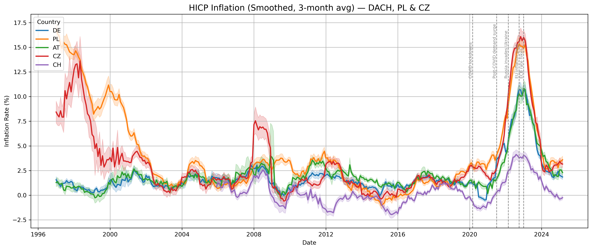

# Inflation Analysis in DACH, Poland & Czechia (2019–2024)

This project explores how inflation has evolved across five key European countries — **Germany, Austria, Switzerland, Poland, and Czechia** — using official **Eurostat HICP data**.

## 🔍 Project Background

Over the weekend, I finally made time to start working on data projects not just for my job (which, unfortunately, I can't share publicly), but also for my **personal portfolio**.

I’m a strong believer in working with **real data, not synthetic samples** — especially when it comes to economic and social trends. So I’m launching a small series of visual explorations based on **Eurostat data**, focusing on the regions that matter most to me:

- 🇩🇪🇦🇹🇨🇭 **DACH** — a region I’ve been fascinated by since school  
- 🇵🇱 **Poland** — where I currently live and work  
- 🇨🇿 **Czechia** — a country I often visit and deeply appreciate

## 📊 What’s inside

- Cleaned and filtered official Eurostat HICP data (2019–2024)
- Smoothed (3-month rolling average) time series
- Annotated visualizations highlighting:
  - COVID lockdowns
  - Post-pandemic demand surge
  - Russia invades Ukraine
  - EU inflation peak
  - ECB interest rate hikes

## 🛠️ Tools Used

- Python
- pandas
- seaborn / matplotlib
- Jupyter Notebook

## 📈 Sample Visualizations

